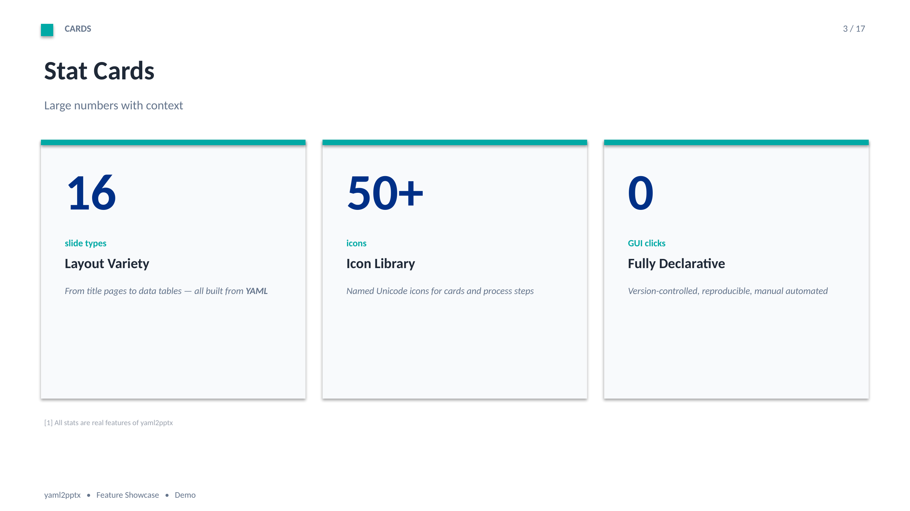
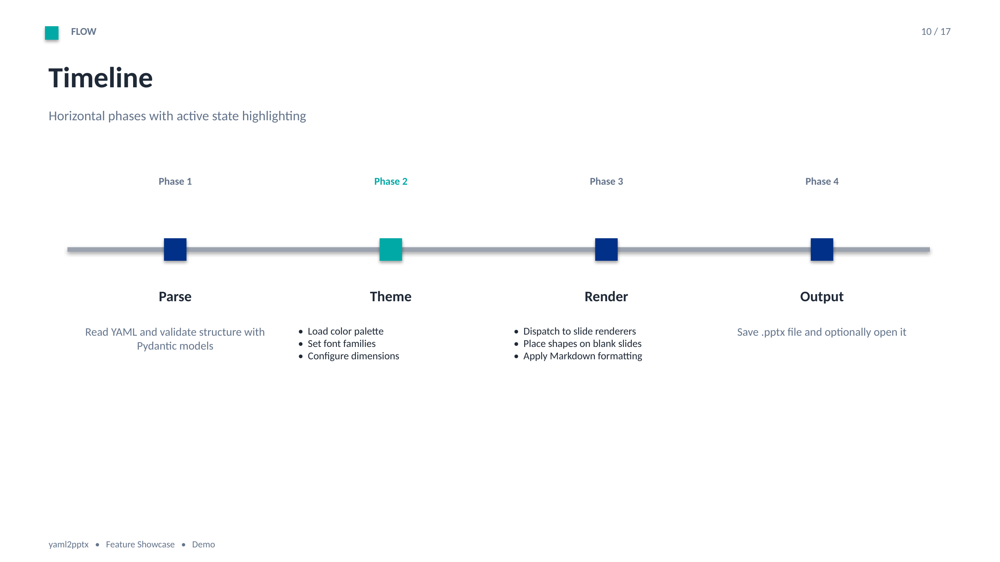
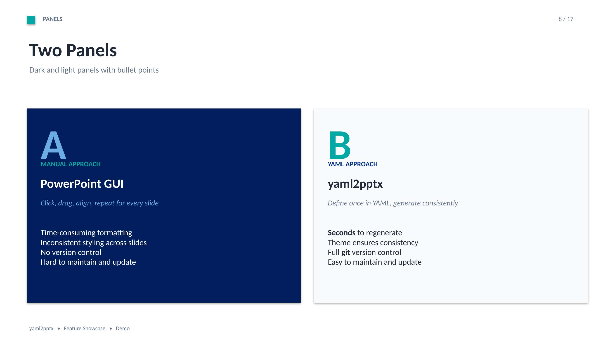
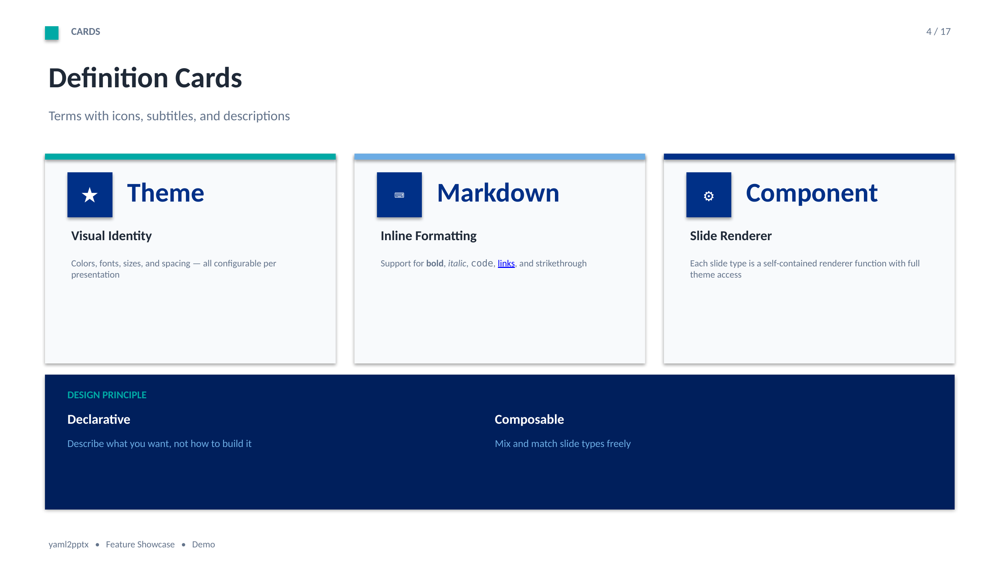
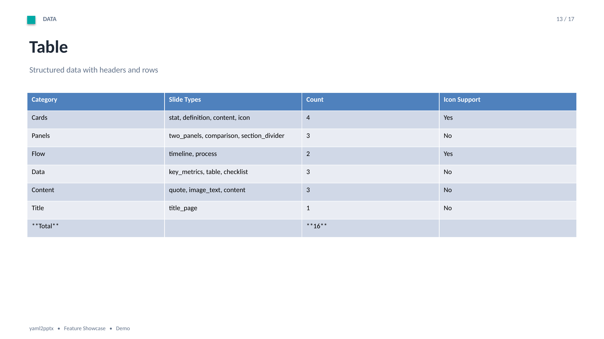
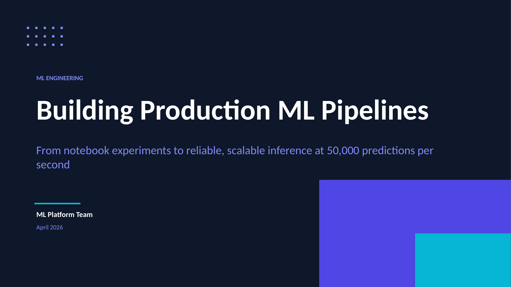

# yaml2pptx

**Generate professional PowerPoint presentations from YAML.** Version-controlled, reproducible, and fully editable output.

Unlike tools like [Marp](https://marp.app) that render slides as flat images, yaml2pptx generates **native PowerPoint** with real shapes, text, and tables — your audience can edit, copy, and reuse the content.

| | | |
|---|---|---|
|  |  |  |
|  |  |  |

*All slides generated from YAML — no PowerPoint GUI needed.*

## Why yaml2pptx?

- **17 slide types** — title pages, timelines, stat cards, comparisons, process flows, metrics dashboards, and more. No CSS or design skills needed.
- **Native .pptx output** — real shapes, editable text, and tables. Not screenshots. Not PDFs.
- **10 built-in themes** — professional color palettes that apply consistently across all slide types.
- **50+ icons** — built-in icon library for cards and process slides.
- **Template support** — use your organization's .pptx template with the `gen` command.
- **Inline Markdown** — `**bold**`, `*italic*`, `` `code` ``, `[links](url)`, `~~strikethrough~~` in any text field.
- **VS Code extension** — live preview, snippets for all slide types, and JSON schema validation.
- **Declarative** — presentations are plain text. Diff them, review them, version them in git.
- **Lightweight** — Python + python-pptx. No browser, no Chromium, no external services.

## Quick Start

```bash
pip install yaml2pptx
```

Create `deck.yaml`:

```yaml
theme: midnight
slides:
  - type: title_page
    title: "Quarterly Review"
    subtitle: "Q1 2026 Results"
    author: "Team Alpha"
    date: "April 2026"

  - type: stat_cards
    section: "HIGHLIGHTS"
    title: "Key Results"
    cards:
      - stat: "142%"
        title: "Revenue Target"
        description: "Exceeded annual target by 42%"
      - stat: "4.8"
        title: "Customer Satisfaction"
        description: "Highest score in company history"
      - stat: "23"
        title: "New Markets"
        description: "Expanded to 23 new regions"

  - type: timeline
    section: "ROADMAP"
    title: "What's Next"
    phases:
      - label: "Q2"
        title: "Platform Launch"
        active: true
        items: ["Beta release", "Partner onboarding"]
      - label: "Q3"
        title: "Scale"
        items: ["Global rollout", "Enterprise tier"]
      - label: "Q4"
        title: "Optimize"
        items: ["Performance tuning", "Analytics v2"]
```

```bash
yaml2pptx build deck.yaml --open
```

This produces a polished presentation with the Midnight theme — dark blue backgrounds, amber accents, consistent typography — without touching PowerPoint.

## Installation

```bash
# From PyPI
pip install yaml2pptx

# From source (development)
git clone https://github.com/fredrsat/yaml2pptx.git
cd yaml2pptx
pip install -e ".[dev]"

# With file watching support
pip install -e ".[watch]"
```

Requires Python 3.10+.

## Commands

| Command | Description |
|---------|-------------|
| `build` | Component-based renderer — builds slides from free-form shapes using a theme |
| `gen` | Template-based renderer — uses .pptx templates with placeholders |
| `inspect` | Shows layouts and placeholders in a .pptx template |
| `init` | Creates a starter YAML file |

```bash
yaml2pptx build presentation.yaml              # Build with default output name
yaml2pptx build presentation.yaml --open        # Build and open in PowerPoint
yaml2pptx gen presentation.yaml -t template.pptx  # Use organization template
yaml2pptx inspect template.pptx                 # See template layouts
yaml2pptx init --name "My Deck"                 # Generate starter YAML
```

---

## YAML Structure

```yaml
output: "output.pptx"             # Output filename
theme: "default"                   # Theme name (see Themes section)
metadata:
  title: "Presentation Title"
  author: "Author Name"
  subject: "Subject"
theme_config:
  organization: "Organization"     # Footer organization name
  document_title: "Doc Title"      # Footer document title
  classification: "Internal"       # Footer classification label
  footer: "Custom footer text"     # Override entire footer

slides:
  - type: title_page
    # ... slide-specific fields
```

---

## Slide Types

yaml2pptx includes 17 slide types. Each type has its own layout and set of fields.

---

### `title_page`

Full-screen title slide with dark background and decorative elements.

```yaml
- type: title_page
  category: "CATEGORY LABEL"        # Small caps label above title
  title: "Main Title"               # Large title (54pt, white)
  subtitle: "Subtitle text"         # Below title (22pt, light blue)
  author: "Author Name"             # Below divider line
  date: "April 2026"                # Below author
```

---

### `agenda`

Numbered table-of-contents with title, description columns and separator lines.

```yaml
- type: agenda
  section: "AGENDA"
  title: "What we'll cover"
  subtitle: "Optional subtitle"
  items:
    - title: "First topic"
      description: "Brief description"
    - title: "Second topic"
      description: "Brief description"
      number: "02"                   # Optional custom number (auto-generated if omitted)
```

---

### `stat_cards`

Cards with large statistics (numbers), labels, and descriptions. Good for key figures.

```yaml
- type: stat_cards
  section: "SECTION LABEL"
  title: "Slide title"
  subtitle: "Optional subtitle"
  cards:
    - stat: "85%"                    # Large number/stat
      label: "of respondents"        # Small label below stat
      title: "Card title"           # Card heading
      description: "Longer text"     # Card body
  footnotes:                         # Optional footnotes at bottom
    - "[1] Source reference"
```

---

### `definition_cards`

Term cards with icon, subtitle, and description. Ideal for glossaries and key concepts.

```yaml
- type: definition_cards
  section: "SECTION"
  title: "Key concepts"
  subtitle: "Optional"
  cards:
    - term: "API"                    # Large term text
      icon: "gear"                   # Icon name (see Icons section)
      subtitle: "Application Programming Interface"
      description: "Explanation text"
      border_color: "#00A9A5"        # Optional custom border color
  callout:                           # Optional dark bar at bottom
    label: "CALLOUT LABEL"
    columns:
      - title: "Column 1"
        description: "Description"
      - title: "Column 2"
        description: "Description"
```

---

### `content_cards`

Feature cards with icon, title, subtitle, and description or bullet points.

```yaml
- type: content_cards
  section: "SECTION"
  title: "Features"
  subtitle: "Optional"
  cards:
    - title: "Card title"
      icon: "shield"                 # Icon name
      subtitle: "Card subtitle"
      description: "Or use description text"
      # OR use points:
      points:
        - "Bullet point 1"
        - "Bullet point 2"
  callout:                           # Optional callout bar
    label: "LABEL"
    columns:
      - title: "Title"
        description: "Text"
```

---

### `icon_cards`

Key message at top with accent-bordered cards below.

```yaml
- type: icon_cards
  section: "KEY MESSAGE"
  message: "The main message text displayed prominently at the top."
  cards:
    - title: "Card title"
      icon: "shield"
      description: "Card description"
```

---

### `two_panels`

Side-by-side panels (A/B comparison) with dark/light backgrounds.

```yaml
- type: two_panels
  section: "SECTION"
  title: "Two approaches"
  subtitle: "Optional"
  left_panel:
    letter: "A"                      # Large letter
    label: "OPTION A"               # Small caps label
    title: "Panel title"
    example: "Example text (italic)"
    dark: true                       # Dark background (default for left)
    points:
      - "Bullet point 1"
      - "Bullet point 2"
  right_panel:
    letter: "B"
    label: "OPTION B"
    title: "Panel title"
    example: "Example text"
    dark: false                      # Light background (default for right)
    points:
      - "Bullet point 1"
      - "Bullet point 2"
```

---

### `comparison`

Two panels with header bars and key-value rows. Good for before/after or side-by-side data.

```yaml
- type: comparison
  section: "SECTION"
  title: "Comparison"
  subtitle: "Optional"
  left_panel:
    header: "BEFORE"                 # Colored header bar text
    title: "Panel title"
    rows:
      - label: "METRIC"             # Key (colored, bold)
        value: "Description"        # Value text
  right_panel:
    header: "AFTER"
    title: "Panel title"
    rows:
      - label: "METRIC"
        value: "Description"
  footer_text: "Optional centered footer text"
```

---

### `section_divider`

Full dark background with large number and title. Use between sections.

```yaml
- type: section_divider
  number: "03"                       # Large number (96pt)
  title: "Section Title"            # Main title (40pt, white)
  subtitle: "Optional subtitle"     # Below title (light blue)
```

---

### `timeline`

Horizontal timeline with phases/milestones and optional items.

```yaml
- type: timeline
  section: "SECTION"
  title: "Project Timeline"
  subtitle: "Optional"
  phases:
    - label: "Q1 2026"              # Above timeline
      title: "Phase name"           # Below timeline
      active: true                   # Highlight this phase (accent color)
      description: "Phase description"
      # OR use items for bullet list:
      items:
        - "Task 1"
        - "Task 2"
```

---

### `process`

Numbered step-by-step process flow in connected cards.

```yaml
- type: process
  section: "SECTION"
  title: "Process Steps"
  subtitle: "Optional"
  steps:
    - number: "1"                    # Step number (auto-generated if omitted)
      icon: "search"                 # Optional icon
      title: "Step title"
      description: "Step description"
      items:                         # Optional sub-items
        - "Detail 1"
        - "Detail 2"
```

---

### `quote`

Large quote with attribution. Optional dark mode.

```yaml
- type: quote
  section: "SECTION"
  quote: "The quote text goes here."
  attribution: "— Speaker Name"
  source: "Publication, Year"
  dark: true                         # Dark background (optional)
```

---

### `key_metrics`

Dashboard-style metrics grid with trend indicators. Supports up to 8 metrics in a 2-row layout.

```yaml
- type: key_metrics
  section: "SECTION"
  title: "Key Metrics"
  subtitle: "Optional"
  metrics:
    - value: "99.9%"                 # Large number
      label: "System uptime"        # Metric label
      trend: "up"                    # "up", "down", or omit
      trend_label: "+0.2pp"         # Trend description
      color: "success"              # "primary", "accent", "success", "warning", "blue", "dark"
```

---

### `checklist`

Status checklist with colored indicators. Supports multi-column layout.

```yaml
- type: checklist
  section: "SECTION"
  title: "Action Items"
  subtitle: "Optional"
  columns: 2                         # 1, 2, or 3 columns
  items:
    - text: "Task description"
      status: "done"                 # "done" (checkmark), "in_progress" (dot), "pending" (circle), "blocked" (x)
      note: "Optional note"         # Small italic text below
```

---

### `image_text`

Image with text content side by side.

```yaml
- type: image_text
  section: "SECTION"
  title: "Slide Title"
  image: "path/to/image.png"
  image_position: "left"             # "left" or "right"
  content:
    - "Bullet point 1"
    - "Bullet point 2"
```

---

### `table`

Data table with headers and rows.

```yaml
- type: table
  section: "SECTION"
  title: "Data Table"
  table:
    headers: ["Column 1", "Column 2", "Column 3"]
    rows:
      - ["Row 1 A", "Row 1 B", "Row 1 C"]
      - ["Row 2 A", "Row 2 B", "Row 2 C"]
```

---

### `content` (fallback)

Simple bullet-point slide. Used for any unrecognized type or explicit `content` type.

```yaml
- type: content
  section: "SECTION"
  title: "Slide Title"
  subtitle: "Optional"
  content:
    - "Bullet point 1"
    - "Bullet point 2"
    - "Bullet point 3"
  # OR as a single string:
  content: "Paragraph text without bullets"
```

---

## Common Fields

All slide types support these optional fields:

| Field | Description |
|-------|-------------|
| `section` | Section label shown in the header (uppercase) |
| `page` | Custom page number (auto-generated if omitted) |
| `speaker_notes` | Speaker notes added to the slide |

## Inline Markdown

Text fields support inline Markdown formatting:

| Syntax | Result |
|--------|--------|
| `**bold**` | **bold** |
| `*italic*` | *italic* |
| `` `code` `` | monospace |
| `[text](url)` | hyperlink |
| `~~strikethrough~~` | strikethrough |

---

## Icons

Cards that support icons (`definition_cards`, `content_cards`, `icon_cards`, `process`) accept an `icon` field with a named icon:

```yaml
cards:
  - title: "Security"
    icon: "shield"
```

### Available Icons

| Category | Icons |
|----------|-------|
| **Security** | `shield`, `lock`, `key`, `unlock` |
| **Technology** | `gear`, `server`, `cloud`, `database`, `code`, `network`, `chip` |
| **People** | `people`, `person`, `mail`, `chat` |
| **Status** | `check`, `cross`, `warning`, `info`, `star`, `flag` |
| **Business** | `chart`, `target`, `trend`, `money`, `document`, `folder` |
| **Health** | `brain`, `heart`, `health`, `science`, `microscope` |
| **Energy** | `lightning`, `globe`, `sun`, `leaf` |
| **Navigation** | `arrow_right`, `arrow_left`, `arrow_up`, `arrow_down`, `search`, `link`, `clock`, `rocket` |
| **Shapes** | `circle`, `square`, `diamond`, `triangle` |

**Aliases:** `gpu`=chip, `ai`=brain, `security`=shield, `settings`=gear, `users`=people, `time`=clock, `data`=database, `success`=check, `error`=cross, `alert`=warning, `plus`=health

---

## Themes

yaml2pptx includes 10 built-in themes. Set the theme in your YAML file:

```yaml
theme: midnight
```



| Theme | Style | Primary | Accent |
|-------|-------|---------|--------|
| `default` | Professional blue | Navy #003087 | Teal #00A9A5 |
| `midnight` | Dark and modern | Dark blue #1A237E | Amber #FFC107 |
| `coral` | Warm and energetic | Deep coral #C4654A | Teal #00897B |
| `forest` | Natural and grounded | Forest green #2E7D32 | Earth brown #8D6E63 |
| `sunset` | Warm golden tones | Deep orange #E65100 | Purple #7B1FA2 |
| `arctic` | Cool and minimal | Ice blue #0277BD | Cyan #00BCD4 |
| `executive` | Dark and formal | Charcoal #212121 | Gold #C9A94E |
| `neon` | Bold and high-contrast | Electric purple #6200EA | Hot pink #FF4081 |
| `earth` | Warm earth tones | Terracotta #A0522D | Olive #6B8E23 |
| `ocean` | Deep sea blues | Ocean blue #01579B | Aqua #26C6DA |

### Theme Config

Override footer and organization info per presentation:

```yaml
theme_config:
  organization: "Company Name"
  document_title: "Document Title"
  classification: "Internal"
  footer: "Custom footer"           # Overrides auto-generated footer
```

---

## Examples

The `examples/` directory contains complete presentations for each theme:

| File | Theme | Description |
|------|-------|-------------|
| `tech_strategy.yaml` | default | Cloud migration strategy |
| `midnight_ml_pipeline.yaml` | midnight | ML pipeline architecture |
| `coral_brand_refresh.yaml` | coral | Brand refresh proposal |
| `forest_sustainability.yaml` | forest | Sustainability report |
| `sunset_pitch_deck.yaml` | sunset | Startup pitch deck |
| `arctic_analytics.yaml` | arctic | Analytics platform overview |
| `executive_board_report.yaml` | executive | Board report |
| `neon_devops_keynote.yaml` | neon | DevOps conference keynote |
| `earth_urban_plan.yaml` | earth | Urban development plan |
| `ocean_research.yaml` | ocean | Marine research findings |
| `showcase.yaml` | default | All 17 slide types demonstrated |
| `product_launch.yaml` | default | Product launch plan |
| `quarterly_review.yaml` | default | Quarterly business review |

```bash
# Build a single example
yaml2pptx build examples/coral_brand_refresh.yaml --open

# Build all examples
for f in examples/*.yaml; do yaml2pptx build "$f"; done
```

---

## VS Code Extension

yaml2pptx includes a VS Code extension for editing YAML presentations with live preview, autocompletion, and validation.

### Installation

Build and install the extension from the `vscode-extension/` directory:

```bash
cd vscode-extension
npm install
npm run compile
npx vsce package
```

Then install the generated `.vsix` file:

- Open VS Code
- `Cmd+Shift+P` (Mac) / `Ctrl+Shift+P` (Windows/Linux)
- "Extensions: Install from VSIX..."
- Select `yaml2pptx-0.1.0.vsix`

Or from the command line:

```bash
code --install-extension yaml2pptx-0.1.0.vsix
```

### Features

#### Live Preview

Open a yaml2pptx YAML file and run the preview command to see a live rendering of your slides in a side panel.

- **Command:** `yaml2pptx: Open Preview`
- **Command Palette:** `Cmd+Shift+P` → "yaml2pptx: Open Preview"
- **Keyboard shortcut:** `Cmd+Shift+Y` (Mac) / `Ctrl+Shift+Y` (Windows/Linux)
- **Editor title bar:** Click the preview icon when a YAML file is open

The preview updates automatically as you type (with 300ms debounce). Navigate between slides with arrow buttons or click thumbnails. All 10 themes render correctly in the preview.

#### Generate PPTX

Generate a PowerPoint file directly from VS Code.

- **Command:** `yaml2pptx: Generate PPTX`
- Opens a terminal and runs `yaml2pptx build` on the current file
- Requires `yaml2pptx` to be installed (`pip install -e .`)

#### Snippets

Type `y2p-` in a YAML file to see available snippets for all 17 slide types:

| Snippet | Description |
|---------|-------------|
| `y2p-presentation` | Full presentation scaffold |
| `y2p-title_page` | Title page slide |
| `y2p-agenda` | Agenda slide |
| `y2p-stat_cards` | Stat cards slide |
| `y2p-definition_cards` | Definition cards slide |
| `y2p-content_cards` | Content cards slide |
| `y2p-icon_cards` | Icon cards slide |
| `y2p-two_panels` | Two panels slide |
| `y2p-comparison` | Comparison slide |
| `y2p-section_divider` | Section divider slide |
| `y2p-timeline` | Timeline slide |
| `y2p-process` | Process steps slide |
| `y2p-quote` | Quote slide |
| `y2p-key_metrics` | Key metrics slide |
| `y2p-checklist` | Checklist slide |
| `y2p-content` | Content slide |
| `y2p-table` | Table slide |

#### Schema Validation

The extension provides JSON schema validation for yaml2pptx YAML files, giving you inline errors and autocomplete for slide types and their fields.

---

## Template-Based Rendering (`gen`)

For organizations with existing PowerPoint templates:

```yaml
template: "template.pptx"
output: "output.pptx"
metadata:
  title: "Title"
slides:
  - layout: title_slide
    title: "Presentation Title"
    subtitle: "Subtitle"
  - layout: content
    title: "Slide Title"
    content:
      - "Point with **bold** and *italic*"
      - text: "Indented point"
        level: 1
    speaker_notes: "Speaker notes here"
```

```bash
yaml2pptx gen presentation.yaml
yaml2pptx inspect template.pptx     # See available layouts
yaml2pptx init --name "My Deck"     # Generate starter YAML
```

---

## How It Compares

| Feature | yaml2pptx | Marp | Google Slides API |
|---------|-----------|------|-------------------|
| Input format | YAML | Markdown | JSON/REST |
| Output | Native .pptx (editable) | HTML, PDF, image-based .pptx | Google Slides |
| Slide types | 17 built-in layouts | Free-form markdown | Manual positioning |
| Themes | 10 built-in | 3 built-in + CSS | Manual styling |
| Icons | 50+ built-in | None | Manual |
| Tables | Native PowerPoint tables | Rendered as images | Supported |
| Template support | Yes (.pptx templates) | CSS only | Yes |
| Dependencies | Python + python-pptx | Node.js + Chromium | API credentials |
| Offline | Yes | Yes | No |
| Editable output | Yes | No (image-based PPTX) | Yes (Google Slides) |

---

## Contributing

Contributions are welcome! See [CONTRIBUTING.md](CONTRIBUTING.md) for guidelines.

```bash
# Development setup
git clone https://github.com/fredrsat/yaml2pptx.git
cd yaml2pptx
pip install -e ".[dev]"
pytest
```

## License

[MIT](LICENSE)
